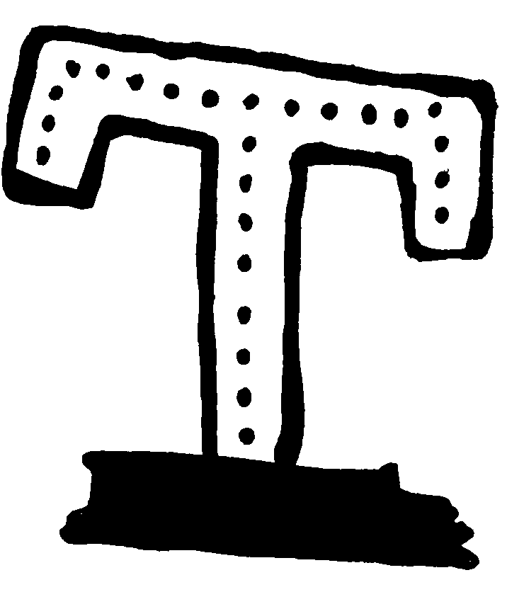

# Kunisch-Multilabel-Learning

Este repositorio contiene el código de  **"Aprendizaje multietiqueta de patrones geométricos en objetos de herencia cultural"**, tesis realizada por el estudiante Matías Vergara (MDS-DCC) durante el año 2022 bajo la guía de los profesores Benjamín Bustos (guía) e Iván Sipirán (coguía) y en colaboración con el TU Graz, Austria.


El problema abordado corresponde a la generación de una herramienta de apoyo al etiquetado de patrones geométricos en objetos de herencia cultural,  un proceso de la arqueología en donde una imagen es descrita a través de una serie de "etiquetas" relativas a sus propiedades geométricas más importantes. Por ejemplo, la imagen a continuación podría describirse por las etiquetas "T-shapped, dotted, vertical", entre otras.

<p align="center">

</p>


Tal desafío se aborda en esta ocasión a través de las figuras y etiquetas disponibles en el libro Ornamente Geometrischen Vasen: Ein Kompendium (Norbert Kunisch, 1998), obra en la cual el autor describe más de 700 patrones geométricos provenientes de objetos encontrados en excavaciones en Grecia durante el siglo XVII. De esta manera,  la meta principal se traduce en el desarrollo de un modelo capaz de ''replicar'' el etiquetado realizado por Kunisch, al recibir algunas figuras ya etiquetadas como ejemplos para el aprendizaje y separándose otras cuantas para la evaluación (aprendizaje supervisado).

La carpeta [documentos](documentos) incluye diversos entregables relativos a la investigación realizada, los cuales se invita al lector a visitar para mayor detalle. Esta sección se dedicará principalmente a la presentación del repositorio y puesta en marcha de los scripts necesarios para la replicación de los resultados.


## Estructura del repositorio

El repositorio incluye diversas carpetas, a saber:

- Una carpeta [dibujos](dibujos) en donde se incluyen algunos ejemplos de patrones geométricos, dibujados a mano por el autor a partir de los patrones ya etiquetados que incorpora el libro Ornamente Geometrischen Vasen: Ein Kompendium, de Norbert Kunisch (1998). Esta carpeta es solo referencial, no juega un papel importante en los experimentos.

- Una carpeta [documentos](documentos), la cual ya fue introducida. Esta carpeta tampoco es necesaria para los experimentos, más se recomienda que si alguien está interesado en continuar la investigación visite al menos el [Informe Final](documentos/Tesis_F.pdf) y la presentación relativa a las técnicas de MLC.

- Una carpeta [patterns](patterns), la cual incorpora las imágenes de los patrones y se organiza según dataset (con carpetas base, blur, etc). Cada carpeta se subdivide además  según fold (0, 1, 2 y 3) y cada fold se subdivide en test, train y val. Finalmente, cada una de estas tres carpetas se divide según los capítulos del libro e incorpora en su interior las imágenes en formato PNG. A continuación se presenta un ejemplo de árbol de directorios.
  
  - Nótese que esta estructura se generará de forma automática mediante la ejecución de los scripts, por lo cual no es necesario armar nada a mano. 
  
  - Nótese también que, además del contenido ya mencionado, esta carpeta debe incluir una subcarpeta adicional de nombre `originals` la cual incorpore los patrones en su formato original y que no puede ser incluida en el repositorio por derechos de autor. Este aspecto se detallará en la sección **Archivos necesarios no incluidos.**
  
  ```bash
  |-- base
  |   |-- 0
  |   |   |-- test
  |   |   |   |-- circular ornaments
  |   |   |   |   |-- 69f.png
  |   |   |   |   `-- 69g.png
  |   |   |   |-- lozenge
  |   |   |   |   |-- 45b.png
  |   |   |   |   `-- 45d.png
  |   |   |   |-- pictographics
  |   |   |   |   |-- 96f.png
  |   |   |   |   `-- 96i.png
  |   |   |   |-- rectangular ornaments
  |   |   |   |   |-- 34e.png
  |   |   |   |   `-- 34g.png
  |   |   |   |-- strokes and lines
  |   |   |   |   |-- 8a.png
  |   |   |   |   `-- 8c.png
  |   |   |   `-- triangular ornaments
  |   |   |       |-- 67c.png
  |   |   |       `-- 68d.png
  |   |   |-- train
  |   |   |   |-- circular ornaments
  |   |   |   |   |-- 89f.png
  |   |   |   |   `-- 89h.png
  |   |   |   |-- lozenge
  |   |   |   |   |-- 45c.png
  |   |   |   |   `-- 45e.png
  |   |   |   |-- pictographics
  |   |   |   |   |-- 96g.png
  |   |   |   |   `-- 96h.png
  |   |   |   |-- rectangular ornaments
  |   |   |   |   |-- 34c.png
  |   |   |   |   `-- 34f.png
  |   |   |   |-- strokes and lines
  |   |   |   |   |-- 9c.png
  |   |   |   |   `-- 9d.png
  |   |   |   `-- triangular ornaments
  |   |   |       |-- 68b.png
  |   |   |       `-- 68c.png
  |   |   `-- val
  |   |       |-- circular ornaments
  |   |       |   |-- 88b.png
  |   |       |   `-- 89e.png
  |   |       |-- lozenge
  |   |       |   |-- 44l.png
  |   |       |   `-- 44m.png
  |   |       |-- pictographic
  |   |       |   |-- 94a.png
  |   |       |   `-- 96d.png
  |   |       |-- rectangular ornaments
  |   |       |   |-- 32h.png
  |   |       |   `-- 33f.png
  |   |       |-- strokes and lines
  |   |       |   |-- 7c.png
  |   |       |   `-- 9e.png
  |   |       `-- triangular ornaments
  |   |           |-- 67j.png
  |   |           `-- 68a.png
  |   |-- 1 ...
  |   |-- 2 ...
  |   |-- 3 ...
  |-- blur ...
  ```

- Una carpeta [labels](labels) en donde se guardan las etiquetas relativas a las imagenes en la carpeta patterns, según la estructura a continuación.
  
  - Esta carpeta se poblará automáticamente mediante los scripts, por lo cual no es necesario crear nada a mano.
  
  - A modo de ejemplo, en el repositorio se incluye la carpeta listada (correspondiente al conjunto base).
  
  - Nótese que la carpeta contiene además los archivos `class_labels.csv`, `original_df.json` y `original_labels.csv`. Todos estos archivos son fundamentales para la ejecución de los scripts y no deben ser removidos. 
  
  ```bash
  |-- base
  |   |-- 0
  |   |   |-- augmented_train_df.json
  |   |   |-- test_df.json
  |   |   `-- val_df.json
  |   |-- 1
  |   |   |-- augmented_train_df.json
  |   |   |-- test_df.json
  |   |   `-- val_df.json
  |   |-- 2
  |   |   |-- augmented_train_df.json
  |   |   |-- test_df.json
  |   |   `-- val_df.json
  |   `-- 3
  |       |-- augmented_train_df.json
  |       |-- test_df.json
  |       `-- val_df.json
  |-- blur ...
  
  
  ```

- Una carpeta [features](features), en donde se guardan los descriptores (a generar) de las imagenes a estudiar, separados por carpetas según su origen (por ejemplo, alexnet o resnet) y según el dataset al que corresponde (base, blur, ref, blur_ref, etc). Cada subcarpeta presenta además una última división según el fold al que corresponde (K0, K1, K2, K3).
  
  - Esta carpeta se poblará automáticamente mediante los scripts, por lo cual no es necesario crear nada a mano.
  
  - A modo de ejemplo, se incluyen los descriptores para el conjunto 'base' obtenidos a partir de AlexNet y ResNet.
- Una carpeta [models](models) en la cual se guardarán los checkpoints de los modelos resultantes, siguiendo la misma estructura de la carpeta features. Se recomienda dejar el contenido de esta carpeta fuera del sistema de versionamiento pues puede crecer considerablemente.
  - Esta carpeta se generará automáticamente mediante los scripts, por lo cual no es necesario crear nada a mano.
- Una carpeta [outputs](outputs) en la cual se guardarán los resultados de cada experimento, con un nombre particular a cada caso pero siguiendo la estructura de modelo/dataset/nombre_experimento/fold.
  - Esta carpeta se poblará automáticamente mediante los scripts, por lo cual no es necesario crear nada a mano.
- Finalmente, el repositorio incluye también una carpeta  [notebooks](notebooks), la cual incluye una serie de notebooks de python los cuales llevan a cabo todos los procesos necesarios asumiendo la estructura de carpetas anteriormente presentada.
  - Nótese que al interior de la carpeta notebooks se encuentran tanto múltiples scripts (.py, .ipynb) como una carpeta de nombre `graficos`. Mientras los scripts son necesarios para la replicación de los experimentos y se encuentran debidamente documentados, el contenido de la carpeta `graficos` no está documentado y se incluye solamente por si alguien, queriendo continuar el trabajo, requiriese inspiración sobre cómo generar las figuras del documento de tesis.

## Ambientes

Para el desarrollo de los experimentos se utilizó Anaconda 3 como gestor de ambientes.     

En general, basta crear un ambiente de Python 3.10 y ejecutar los siguientes comandos (véase [requirementsP10.txt](requirementsP10.txt)):

```bash
# Instalación de Pytorch. Podría cambiar según OS, ver pytorch.org
conda install pytorch torchvision torchaudio pytorch-cuda=11.6 -c pytorch -c nvidia 

# Manipulación de datos, visualizaciones
conda install numpy pandas sklearn matplotlib seaborn scipy 

# Aprendizaje multietiqueta desde Enfoque Tradicional
conda install skmultilearn

# Generación de imagenes sintéticas
conda install -c conda-forge imgaug

# Manipulación de imágenes 
conda install -c conda-forge opencv

# Procesamiento de etiquetas
conda install -c anaconda nltk
```

Existe sin embargo un experimento que requiere un ambiente adicional en Python 3.8 pues utiliza una versión específica de `scikit-learn` no compatible con Python 3.10: se trata del Enfoque Tradicional mediante métodos de transformación del algoritmo (BRkNN, MLkNN). Para tal fin, basta crear un segundo ambiente con Python 3.8 y ejecutar los mismos comandos pero especificando la versión de scikit (véase [requirementsP38.txt](requirementsP38.txt)):

```bash
conda install scikit-learn=0.24.1
conda install scikit-multilearn=0.2.0
```

## Archivos necesarios no incluidos

Como se mencionase en la presentación de la carpeta `patterns`, existe una carpeta la cual es fundamental para la ejecución de los experimentos y que sin embargo no debe ser versionada por razones de copyright. Se trata de la carpeta `originals`, la cual debe ubicarse al interior de la carpeta `patterns` y contener en su interior las imagenes PNG de los distintos patrones geométricos de Ornamente Geometrischen Vasen, siguiendo la estructura originals/nombre_patron/nombre_patron.png, como se muestra a continuación.

```bash
|-- originals
|   |-- 1a
|   |   `-- 1a.png
|   |-- 1b
|   |   `-- 2b.png
|   |-- 1c
|   |   `-- 1c.png
|   ...
```

Para obtener acceso a estos datos, consultar con profesores Benjamín Bustos o Iván Sipirán (DCC UChile).

## Notebooks y ejecución
